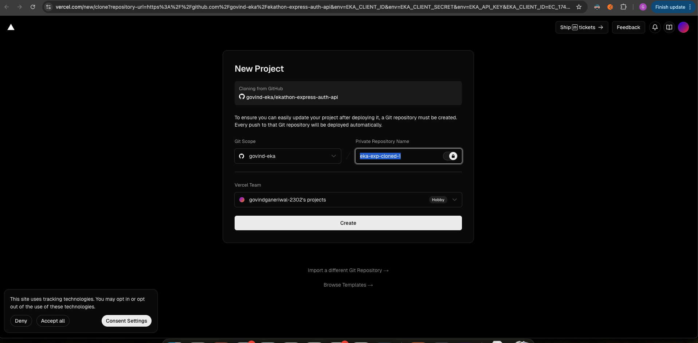
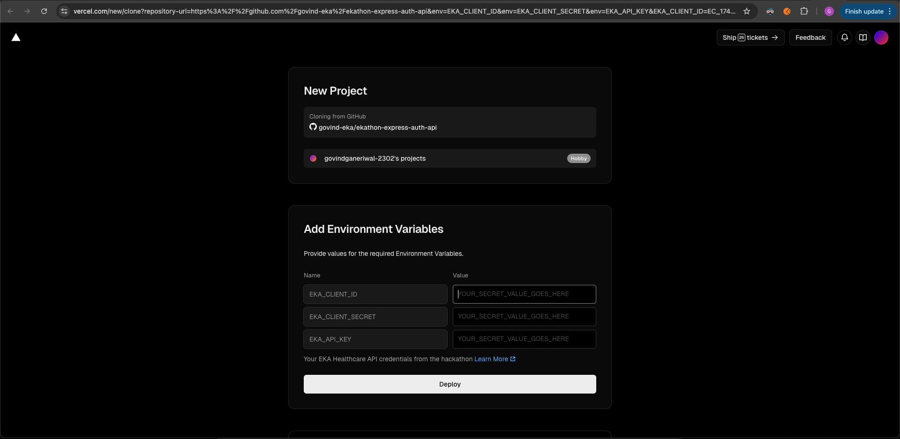
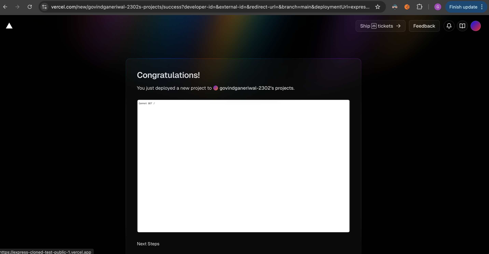

# EKA Healthcare Auth Proxy - Next.js

repo to be used when initializing eka care's SDK on FE directly
obtain your client ID, client secret and API key. Click on the `deploy` button below. this makes a repo in your GH account by cloning our repo, initializes a vercel project and connects the project with the cloned repo. And now when initializing the SDK on a FE client side app you can use the domain (that vercel assigns upon successful deployment) and leverage the pre made API route. (more on that, link)

## 🚀 One-Click Deploy

- make sure to obtain your client ID, client secret and api key and click on the button below

[](https://vercel.com/new/clone?repository-url=https%3A%2F%2Fgithub.com%2Fgovind-eka%2Fekathon-next-auth-api&env=EKA_CLIENT_ID,EKA_CLIENT_SECRET,EKA_API_KEY&envDescription=Your%20EKA%20Healthcare%20API%20credentials%20from%20the%20hackathon&envLink=https%3A%2F%2Fdeveloper.eka.care%2Fapi-reference%2F)

- after clicking on the button you will be taken to this kind of a UI, where vercel clones to your GH. and initializes a vercel project
  

- click the create button

- you are now prompted to enter your credentials that get stored as env vars in your own vercel account and these credentials are then used in the `api/manage-auth` route
  
  fill the respective values and click deploy

- and in about 10-20 seconds the deployment should be successful on your own vercel domain with the env vars in place
  

## 📋 Usage

After deployment, use your Vercel URL in the EKA SDK, on Frontend:

```js
const eka = createEkaInstance({
  source: "FE",
  auth_token: "initial-token",
  backendAuthEndpointURL: "https://URL-that-vercel-gives-you/api/manage-auth",
  base_url: "https://api.eka.care" | "https://api.dev.eka.care",
});
```
